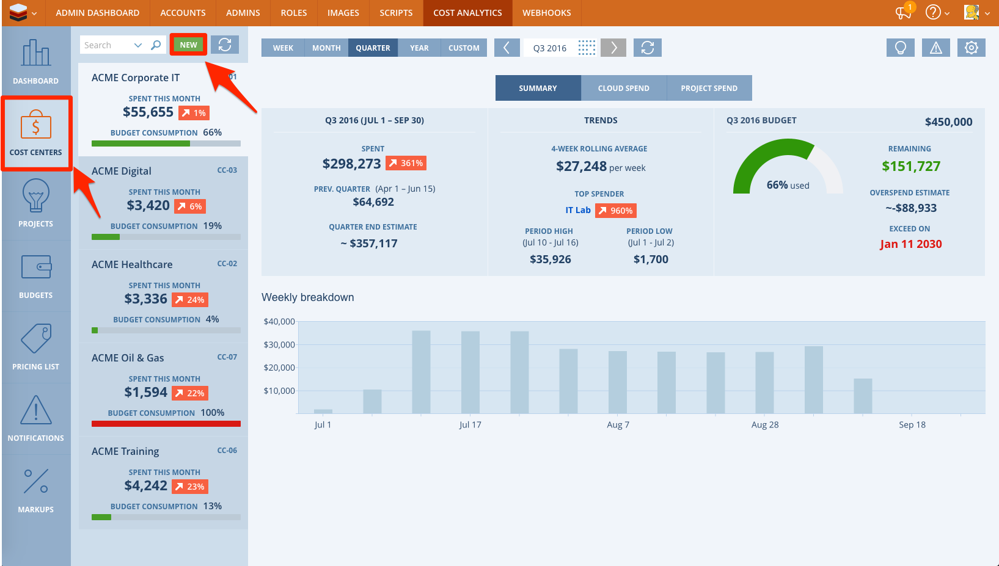
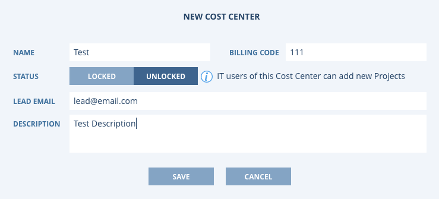
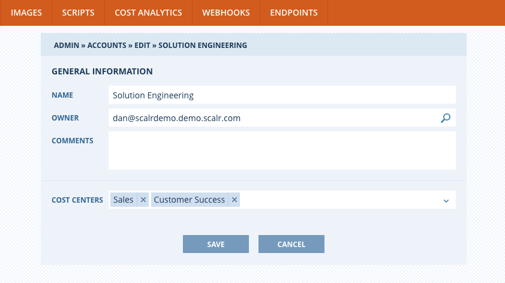
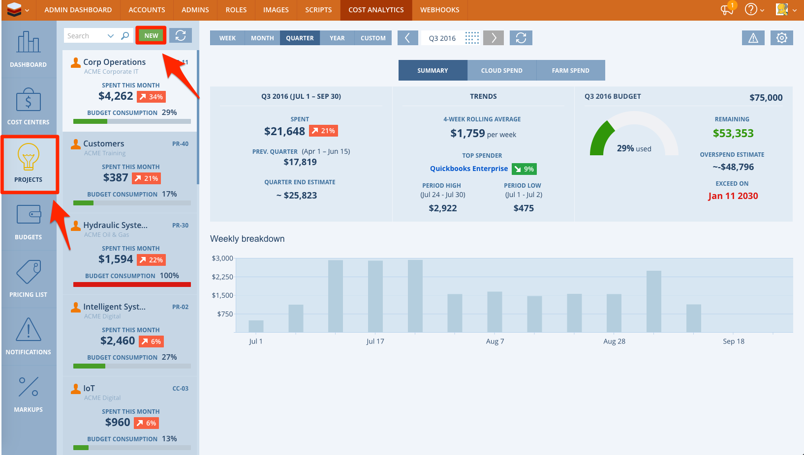
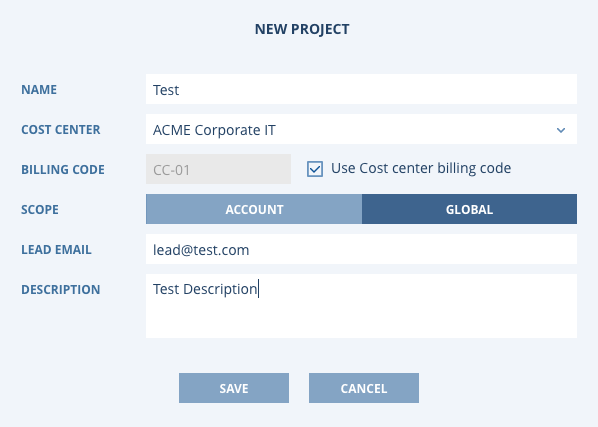
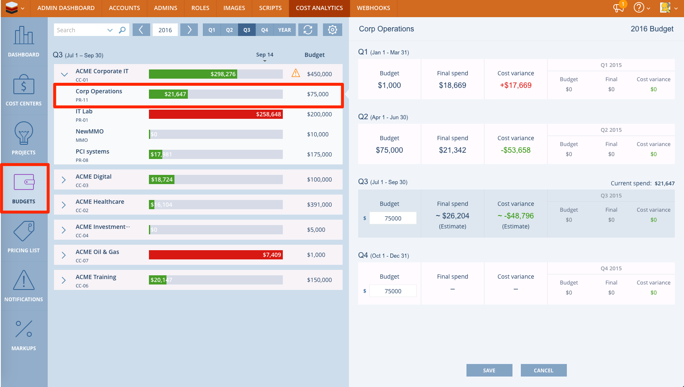
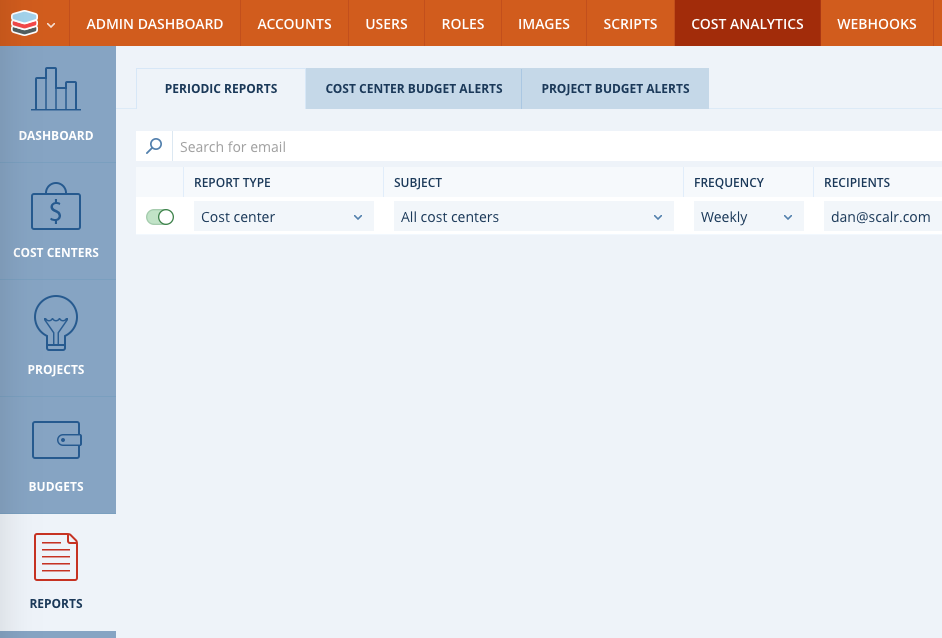
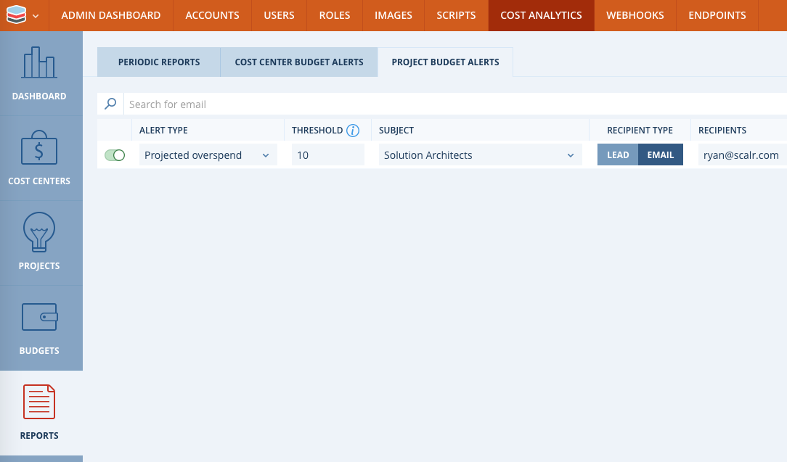
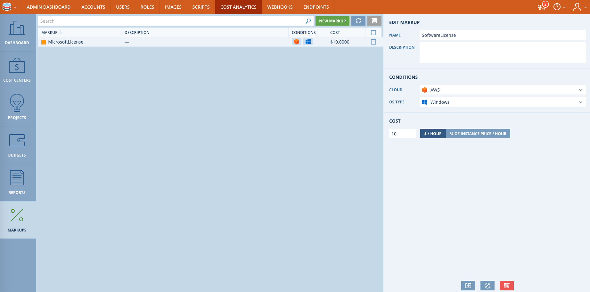

.. include:: ../GLOBAL.rst

.. _cost_control:

Cost Analytics
==============

Definition and Scope
--------------------

|SCOPE_SCALR| |SCOPE_ACC| |SCOPE_ENV|

The ability to see Cost Analytics exists at the |SCALR|, |ACCOUNT|, and |ENVIRONMENT| scopes. At each scope you will only see the cost related to that scope, for example, at the |SCALR| you will see all of the cost the has rolled up across all |ACCOUNTS| and |ENVIRONMENTS|. If you are logged into a specific |ENVIRONMENT|, you will only see cost for those resources managed within that |ENVIRONMENT|.

.. note::
  You will only see cost for those cloud resources that are managed in Scalr.

There are two organizational concepts with Cost Analytics:

* Cost Centers - Cost Centers are high-level resource allocation centers. In your organization, Cost Centers might map to business units. A Cost Center is a parent of a Project. Every |ACCOUNT| created in Scalr can have one or more Cost Centers and every |ENVIRONMENT| can have only one Cost Center associated with it.

* Projects - Projects are low-level resource allocation centers. In your organization, Projects might map to the individual projects or billing codes that are launched by your various business units. A Project is a child of a Cost Center. Every Farm that is launched in Scalr requires a Project assignment.

Cost Centers
------------

Cost Centers are created through the |SCALR| scope:

Once a Cost Center is created, it then needs to be assigned to an |ACCOUNT|:

Projects
--------

Projects may exist in the |SCALR| Scope, or in the scope of an individual |ACCOUNT|. Global Projects are available in any |ACCOUNT| (provided the |ACCOUNT| has access to the Project's parent Cost Center)

To create a project, go to the |SCALR| or |ACCOUNT| scope, click on Cost Analytics and then Projects:

After Projects have been created, you can then associate them with Farms. When you associate a Project with a Farm, the costs generated by this Farm will be rolled up to the Project. They'll also be rolled up to the Project's parent Cost Center.

Budgets
-------

Budgets may exist in the |SCALR| Scope, or in the scope of an individual |ACCOUNT|. Budgets can be defined for the Cost Center and/or the Projects.

Reports can be configured to notify users that are about to exceed their budget (or to alert other users). See the next section on Reports to configure the notifications.

Reports
-------

There are a few types of Reports that can be created within Cost Analytics:

Periodic Reports
^^^^^^^^^^^^^^^^

* At the |SCALR| scope you can create the following types of reports:

  * Total Summary - A report that summarizes the cost for all Cost Centers.
  * Cost Center - A report that summarizes the spend/budget for a specific Cost Center.
  * Project - A report that summarizes the spend/budget for a specific project.

* At the |ACCOUNT| scope you can create the following report:

  * Projects - A report that summarizes the spend/budget for a specific project.

Cost Center and Budget Alerts
^^^^^^^^^^^^^^^^^^^^^^^^^^^^^

* At the |SCALR| scope you can create alerts for:

  * Cost Centers - A threshold can be set and if the budget is within the threshold an alert will be sent.
  * Projects - A threshold can be set and if the budget is within the threshold an alert will be sent.

* At the |ACCOUNT| scope you can create the following type of alert:

  * Projects - A threshold can be set and if the budget is within the threshold an alert will be sent.

Markups
-------

Within Cost Analytics, there is an option to create Markups.  Markups are a pre-defined cost that are applied to instances based on a set of conditions.  The Markup cost may be configured as either a flat rate per hour, or as a percentage of the base cost per hour. Markups will be applied at all scopes below the scope where they are defined.

Markup costs may then be viewed within the Cost Analytics page for a given |ENVIRONMENT|.  Individual line items will be shown for each Markup under the “Other” section.
